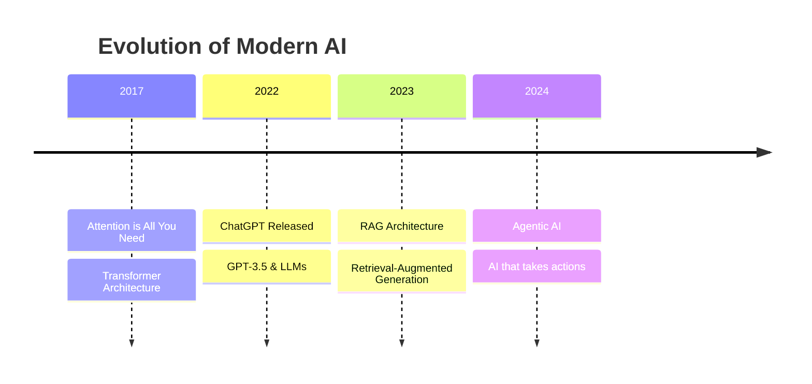
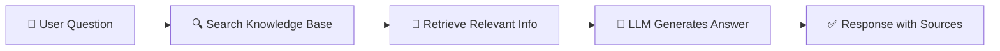
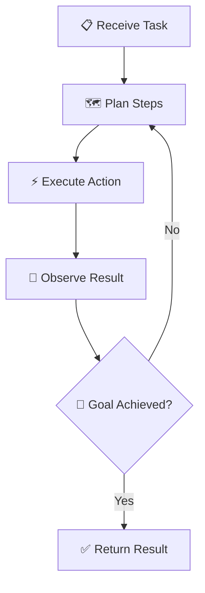

# What is Agentic AI?

Understanding the Evolution of Modern AI

  For UX/Visual Design Students

---
transition: fade-out
---

# The Journey of Modern AI

A timeline of key breakthroughs that led to Agentic AI

<v-click>

Each step built on the previous one, solving new problems and unlocking new capabilities.

</v-click>

---
transition: slide-up
---

# Transformer Architecture

The foundation that made modern AI possible

- **June 2017**: Google researchers published "Attention is All You Need"
- Introduced a new way for AI to understand language
- **Key insight**: AI can look at *all words* in a sentence at once
- This "attention mechanism" helps AI understand context better

<v-click>

- **GPT** = *Generative Pre-trained Transformer*
- Uses this architecture to generate human-like text

</v-click>

<!-- Placeholder for attention visualization -->

  

  
Attention mechanism visualization

  
Words connecting to related words

---
transition: slide-up
---

# ChatGPT & The Rise of LLMs

When AI became accessible to everyone

- **November 2022**: ChatGPT launched to the public
- First time anyone could chat with an advanced AI
- Reached 100 million users in just 2 months!

<v-click>

- **LLM** = *Large Language Model*
- Trained on massive amounts of text from the internet
- Can generate human-like responses to any question

</v-click>

<v-click>

### The Limitation

- LLMs only know what they were trained on
- Knowledge is "frozen" at a point in time
- Can't access new information or verify facts

</v-click>

<!-- Placeholder for chat interface -->

  

  
Chat interface mockup

  
User asking questions, AI responding

---
transition: slide-up
---

# RAG: Retrieval-Augmented Generation

Giving AI access to external knowledge

**The Problem**: LLMs only know what they were trained on  
**The Solution**: Let AI search for information before answering

<v-click>

  

    
Think of it like...

    
AI + Search Engine working together

  

  

    
Benefits

    
Up-to-date info, cites sources

  

  

    
Examples

    
Perplexity, Bing Chat, Google AI

  

</v-click>

---
transition: slide-up
---

# Agentic AI

From responding → to *acting*

<v-click>

### What makes AI "Agentic"?

- **Plans**: Breaks down complex tasks into steps
- **Acts**: Uses tools (browse web, write code, send emails)
- **Decides**: Makes choices autonomously
- **Learns**: Improves based on results

</v-click>

<v-click>

### Real Examples

- GitHub Copilot building features
- AI assistants booking travel
- AI agents researching topics
- Tools like this presentation assistant!

</v-click>

  The Agent Loop: Plan → Act → Observe → Repeat

---
layout: center
class: text-center
---

# Key Takeaways

  

    
🧠

    
Transformers

    
The architecture that understands context

  

  

    
💬

    
LLMs

    
AI that generates human-like text

  

  

    
🔍

    
RAG

    
AI + Search for current info

  

  

    
🤖

    
Agentic AI

    
AI that plans and takes action

  

  Each innovation built on the last, expanding what AI can do.

<PoweredBySlidev mt-10 />
