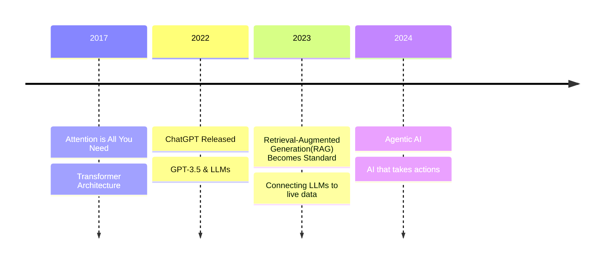
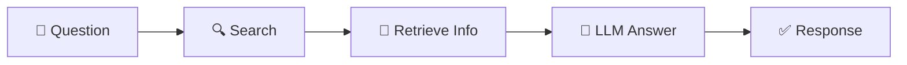
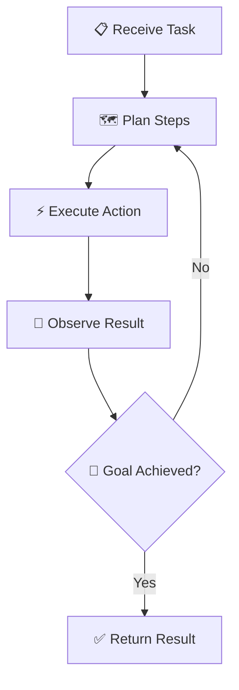

# What is Agentic AI?

Understanding the Evolution of Modern AI

---
transition: fade-out
---

# The Journey of Modern AI

A timeline of key breakthroughs that led to Agentic AI

---
transition: slide-up
---

# Transformer Architecture and Attention Mechanism

The foundation that made modern AI possible

- **June 2017**: Google researchers published "Attention is All You Need"
- **Key insight**: AI can understand relationships between *all words* simultaneously
- This "attention mechanism" helps AI understand context better

<v-click>

- **GPT** = *Generative Pre-trained Transformer*

</v-click>

<v-click>

- The output? **Embeddings**—numerical representations that capture meaning
- But what exactly goes *into* this attention mechanism? → **Tokens**

</v-click>

---
transition: slide-up
---

# How LLMs Understand Language

From tokens to embeddings—what the Transformer actually processes

  <strong>The Flow:</strong> Text → <strong>Tokens</strong> → Transformer (Attention) → <strong>Embeddings</strong> → Meaning

### Tokens: The Input

- Remember: the Transformer needs input to process
- LLMs don't read words—they read **tokens**
- Tokens are pieces of text (words, parts of words, punctuation)
- Example: "understanding" → `["under", "stand", "ing"]`

<v-click>

- A typical prompt might be **hundreds of tokens**
- Models have token limits (context window)

</v-click>

<v-click>

### Semantic Understanding

- LLMs: understand **meaning** and relationships

</v-click>

<v-click>

| Keyword Search | Semantic Understanding |
|----------------|----------------------|
| "car" ≠ "automobile" | "car" ≈ "automobile" |
| Matches exact words | Understands concepts |
| "bank" = "bank" | "river bank" ≠ "savings bank" |

</v-click>

<v-click>

  <strong>Key Insight:</strong> LLMs convert tokens into vectors (embeddings) that capture meaning—similar concepts are "close" in this space.

</v-click>

---
transition: slide-up
---

# ChatGPT & The Rise of LLMs

When AI became accessible to everyone

- **November 2022**: ChatGPT launched to the public
- First time millions could easily chat with a state-of-the-art AI
- Reached 100 million users in just 2 months!

<v-click>

- Trained on massive amounts of text from the internet
- Can generate human-like responses to a wide range of questions

</v-click>

<v-click>

## The Limitation

- LLMs only know what they were trained on
- Can't access new information or verify facts

</v-click>

---
transition: slide-up
---

# RAG: Retrieval-Augmented Generation

Giving AI access to external knowledge

**The Problem**: LLMs only know what they were trained on  
**The Solution**: Let AI search for information before answering

<v-click>

  

    
Think of it like...

    
AI + Search Engine working together

  

  

    
Benefits

    
Up-to-date info, cites sources

  

  

    
Examples

    
Perplexity, Bing Chat, Google AI

  

</v-click>

---
transition: slide-up
---

# Agentic AI

From responding → to *acting*

<v-click>

### What makes AI "Agentic"?

- **Plans**: Breaks down complex tasks into steps
- **Acts**: Uses tools (browse web, write code, send emails)
- **Decides**: Makes choices autonomously
- **Iterates**: Refines approach based on feedback

</v-click>

<v-click>

### Real Examples

- AI coding assistants writing code
- AI assistants booking travel
- AI agents researching topics
- Tools like this presentation assistant!

</v-click>

  The Agent Loop: Plan → Act → Observe → Repeat

---
layout: center
class: text-center
---

# Key Takeaways

  

    
🧠

    
Transformers

    
The architecture that understands context

  

  

    
💬

    
LLMs

    
AI that generates human-like text

  

  

    
🔍

    
RAG

    
AI + Search for current info

  

  

    
🤖

    
Agentic AI

    
AI that plans and takes action

  

  Attention reads, LLMs write, RAG researches, but Agents do.

<PoweredBySlidev mt-10 />
